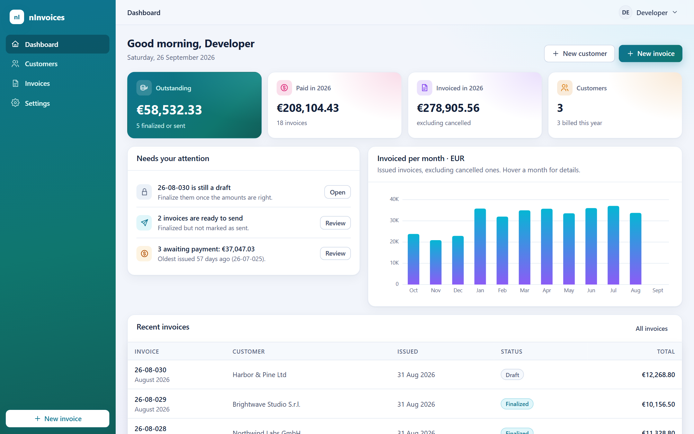
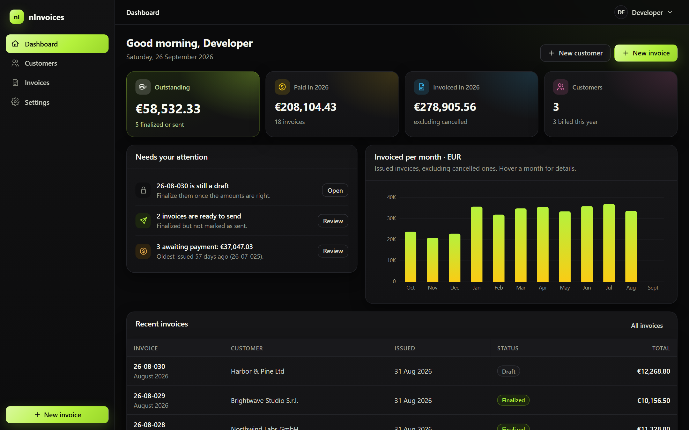
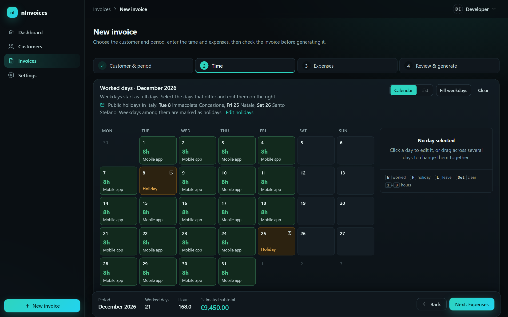
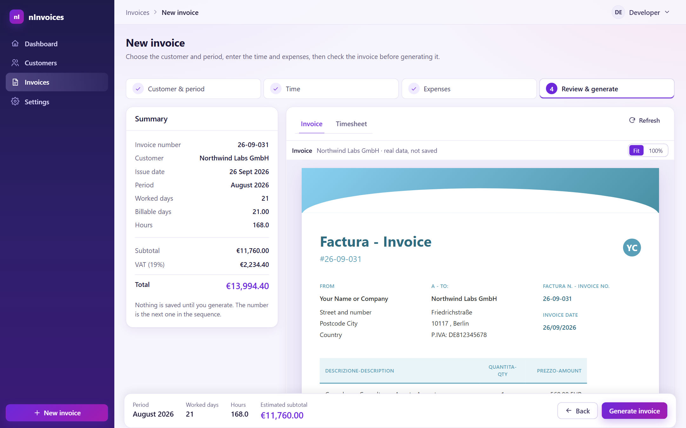
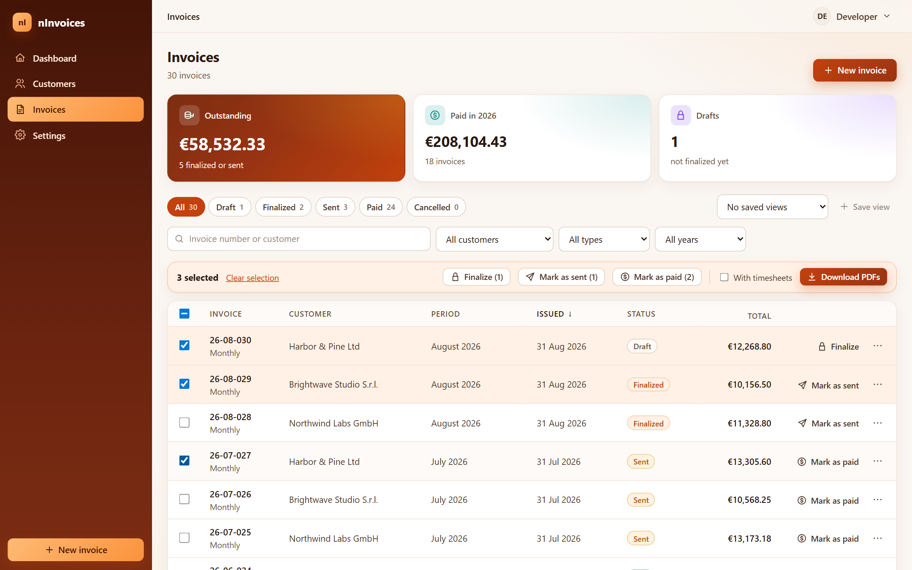
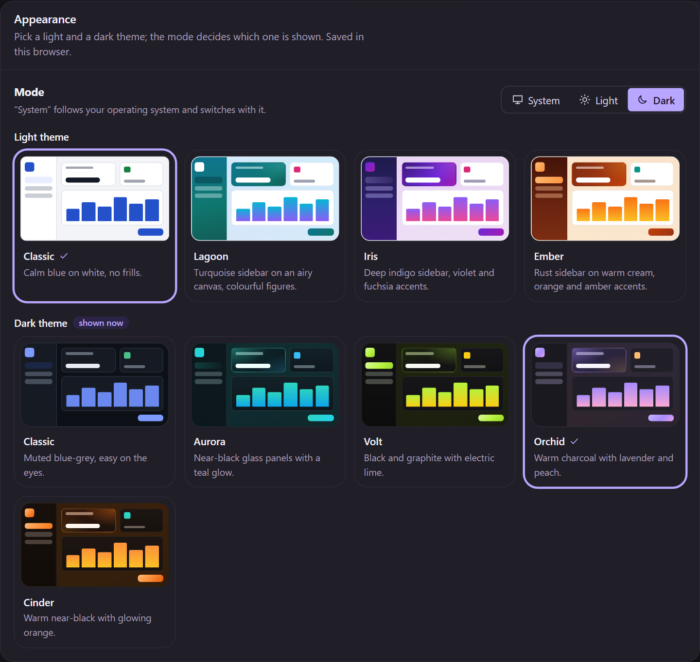

<div align="center">

# nInvoices

**Invoices and timesheets for freelancers who bill by the day or the hour. Self-hosted, and yours.**

Mark the days you worked, check the invoice before it exists, and send the PDF, all in a few clicks.

[](LICENSE.md)




</div>

## Why nInvoices

Most invoicing tools are built for shops that sell products. Freelancers and consultants invoice **time**: days worked for a client each month, sometimes split across projects, with public holidays, half days and travel expenses along the way. The client usually wants a **timesheet** next to the invoice.

nInvoices is built around that monthly routine:

- **Your month on a calendar.** Weekdays start as full days and public holidays are already marked. You only touch the days that differ.
- **See the real invoice before it's created.** The last step renders the actual invoice PDF and timesheet with your data, and nothing is saved until you press *Generate*.
- **Your layout, your language.** Invoices and timesheets are HTML templates you design, with dates and month names in each client's language.
- **Self-hosted.** Your clients, rates and invoices stay on your own server or laptop.

## Features

### Time and invoices
- **Guided "New invoice" wizard:** customer and period → time → expenses → review and generate.
- **Calendar and list views of the month** with full, partial and split days, notes, and keyboard shortcuts (`W`, `H`, `L`, `1`–`8`).
- **Projects per customer:** split a day across projects, and see per-project totals on the invoice and timesheet.
- **Public holidays per country**, filled in automatically. Built-in calendars for Italy, Germany, Austria, France, Spain, the UK and the US, editable in Settings (add a patron saint's day, or any country).
- **Daily, hourly and monthly rates**, in any currency.
- **Taxes as rules:** percentage, fixed amount or compound (tax on tax), applied in order.
- **Expenses** added to the invoice, in the invoice's currency or another one.

### Documents
- **HTML templates** for invoices and timesheets using [Scriban](https://github.com/scriban/scriban) syntax: loops, conditions, formatting and localisation helpers.
- **Template editor with live preview** and a panel of available variables.
- **Pixel-exact PDFs** rendered by headless Chrome, for invoices, timesheets and a worked-days calendar.
- **Configurable invoice numbers**, e.g. `{YEAR}-{MONTH:00}-{NUMBER:000}`.

### Getting paid
- **Invoice lifecycle:** Draft → Finalized → Sent → Paid, or Cancelled.
- **Dashboard** with outstanding and paid totals, invoiced per month, and a *Needs your attention* list (missing monthly invoices, drafts, overdue payments).
- **Invoice list that scales:** server-side search, filters, sorting and paging, plus saved views.
- **Bulk actions:** finalize, mark as sent or mark as paid in one go, or download many PDFs, with their timesheets, as a single zip.
- **Gmail drafts (optional):** compose the email from a per-customer template and create a Gmail draft with the PDFs attached; you review and send it from Gmail. Needs your own Google OAuth client.

### Look and feel
- **Nine themes**, four light and five dark, with a separate choice for day and night that can follow your operating system.
- **Readable by design:** body text meets WCAG AA contrast in every theme, the calendar works from the keyboard, and animations respect *reduce motion*.

### Your data
- **PostgreSQL or SQLite.**
- **JSON export and import** of customers, templates and invoices, for backups or moving to another server.
- **Sign-in with Keycloak** (OpenID Connect), with a no-login mode for local use.

## Screenshots

| | |
|---|---|
|  **Dashboard** in the *Volt* dark theme |  **Time step:** holidays pre-marked (*Aurora*) |
|  **Review:** the real invoice before it's saved (*Iris*) |  **Invoices:** filters, saved views and bulk actions (*Ember*) |

<p align="center">
  <br>
  <em>Pick one light and one dark theme; nInvoices switches with your system.</em>
</p>

<sub>All names, companies and amounts in the screenshots are fictional.</sub>

## Quick start

Run nInvoices on your machine in a few minutes, with a local SQLite database and no login.

**You need:** [.NET 10 SDK](https://dotnet.microsoft.com/download/dotnet/10.0) and [Node.js 20+](https://nodejs.org/).

```bash
git clone https://github.com/algiro/nInvoices.git
cd nInvoices

# 1. Let the API run locally without a login server
cp src/nInvoices.Api/Properties/launchSettings.template.json src/nInvoices.Api/Properties/launchSettings.json

# 2. Create the SQLite database
dotnet tool install --global dotnet-ef
dotnet ef database update -p src/nInvoices.Infrastructure -s src/nInvoices.Api

# 3. Start the API (http://localhost:5297)
cd src/nInvoices.Api && dotnet run
```

In a second terminal:

```bash
cd src/nInvoices.Web
npm install
npm run dev
```

Open **http://localhost:3000**, add your first customer with a rate, and create an invoice.

> The first PDF takes a little longer: the API downloads the headless Chrome it uses for rendering, once.

## Running it for real

| Option | Good for | How |
|---|---|---|
| **Docker Compose** | Your own server | PostgreSQL + Keycloak + API + web, behind your reverse proxy. See [`docker/README.md`](docker/README.md) and [`QUICKSTART.md`](QUICKSTART.md). |
| **.NET Aspire** | Trying the full stack locally | `aspire run --project src/nInvoices.AppHost` starts PostgreSQL, Keycloak (test user `testuser` / `Test123!`), the API and the web app. Needs Docker. See [`src/nInvoices.AppHost/README.md`](src/nInvoices.AppHost/README.md). |
| **Local, SQLite** | One person on one machine | The [quick start](#quick-start) above. |

PostgreSQL schema changes are shipped as idempotent SQL scripts in [`docker/migrations-postgres/`](docker/migrations-postgres/README.md).

## How it's built

- **Backend:** .NET 10 and ASP.NET Core, following Clean Architecture (`Core` ← `Application` ← `Infrastructure` ← `Api`). CQRS with MediatR, FluentValidation, and Entity Framework Core for PostgreSQL and SQLite. Scriban for templates, PuppeteerSharp for PDFs, Serilog and OpenTelemetry for logs and traces.
- **Frontend:** Vue 3 (Composition API), TypeScript, Vite and Pinia. No UI framework: a small design system of CSS variables drives the nine themes.
- **Tests:** NUnit, Shouldly and Moq. Repository queries are tested against a real SQLite database.

```
src/
  nInvoices.Core/            entities, value objects, interfaces
  nInvoices.Application/     commands, queries, services (generation, templates, holidays)
  nInvoices.Infrastructure/  EF Core, PDF export, tax handlers, Gmail
  nInvoices.Api/             ASP.NET Core API
  nInvoices.Web/             Vue 3 app
  nInvoices.AppHost/         .NET Aspire orchestrator (local only)
tests/                       unit and integration tests
docker/                      Dockerfiles, compose files, deploy and migration scripts
Docs/                        template guide, backlog, screenshots
```

```bash
dotnet test                      # backend tests
cd src/nInvoices.Web && npm run build   # type-check and build the frontend
```

## Roadmap

Next on the list (see [`Docs/UI-BACKLOG.md`](Docs/UI-BACKLOG.md)):

- **Autosaved drafts** of an invoice in progress
- **Week view** for customers with several projects
- **Command palette** (`Ctrl+K`) and more keyboard shortcuts

Ideas and bug reports are welcome in [Issues](https://github.com/algiro/nInvoices/issues).

## Contributing

Issues, questions and suggestions are very welcome. For code changes, please **open an issue first** so we can agree on the approach before you invest time. Pull requests are accepted under the project's license (see below).

## License

nInvoices is **free to use, but it is not open source**. It is *source-available* under the [**PolyForm Shield License 1.0.0**](LICENSE.md).

In plain words:

- ✅ **Use it for free**, for any purpose, **including running your own freelance business**: invoicing your clients is fine.
- ✅ **Self-host it, read the code, and change it** to fit your needs.
- ✅ **Share copies**, as long as they keep the license and the copyright notice.
- ❌ **Don't offer it, or something built from it, as a competing product or service**, for example selling it, hosting it for other people, or publishing a rival invoicing app based on it. Under this license, a product competes even when it's free.

This summary is a convenience; the [license text](LICENSE.md) is what applies. If you'd like to use nInvoices in a way the license doesn't allow, please [open an issue](https://github.com/algiro/nInvoices/issues) to talk about a separate license.

Copyright © Alessandro Girotto.
