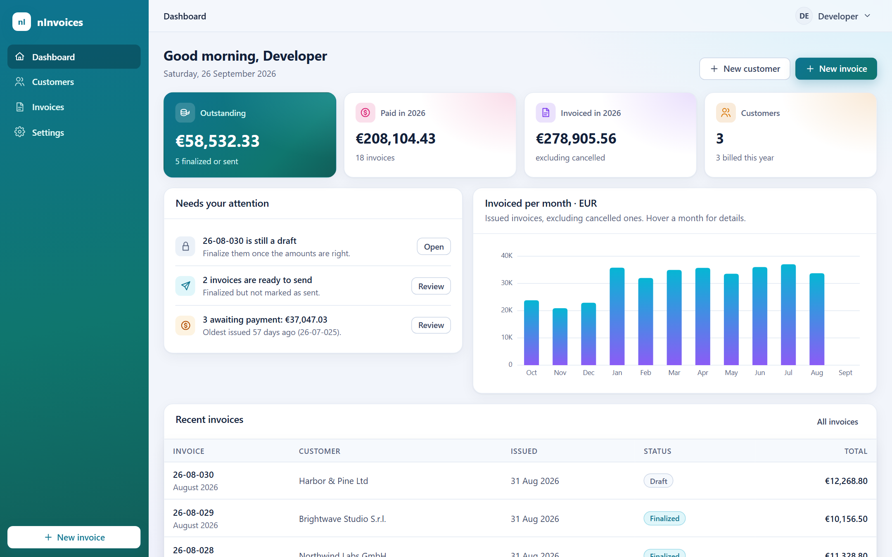
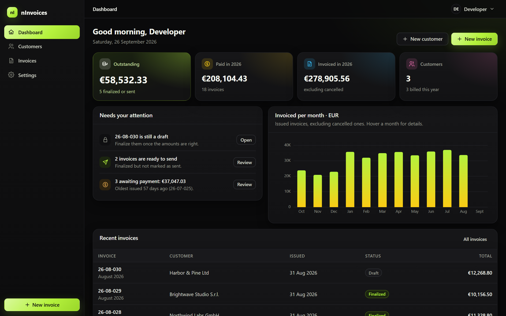
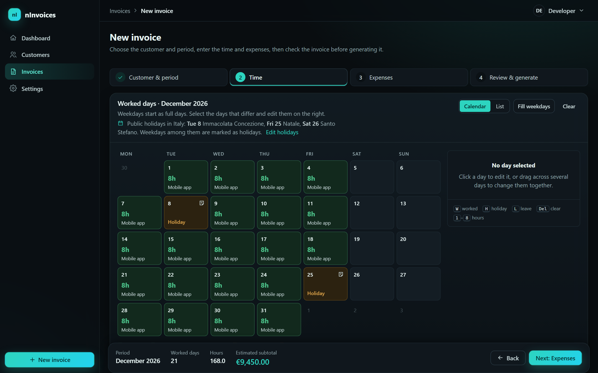
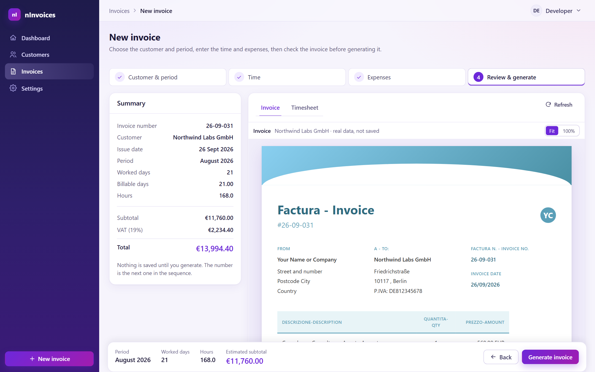
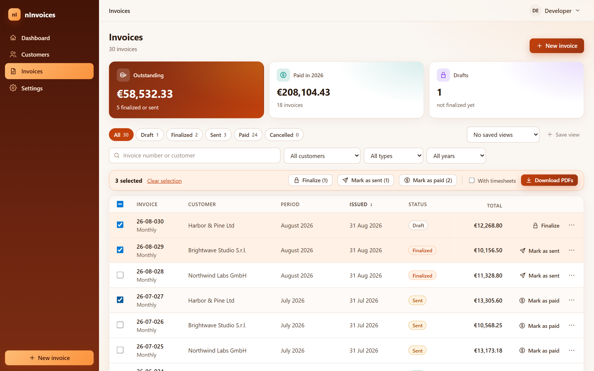
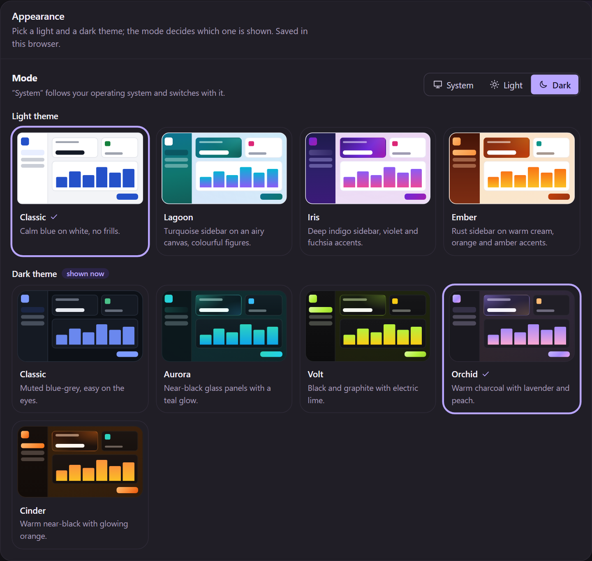

<div align="center">

# nInvoices

**Invoices and timesheets for freelancers who bill by the day or the hour. Self-hosted, and yours.**

Mark the days you worked, check the invoice before it exists, and send the PDF, all in a few clicks.

[](LICENSE.md)




</div>

## Why nInvoices

Most invoicing tools are built for shops that sell products. Freelancers and consultants invoice **time**: days worked for a client each month, sometimes split across projects, with public holidays, half days and travel expenses along the way. The client usually wants a **timesheet** next to the invoice.

nInvoices is built around that monthly routine:

- **Your month on a calendar.** Weekdays start as full days and public holidays are already marked. You only touch the days that differ.
- **See the real invoice before it's created.** The last step renders the actual invoice PDF and timesheet with your data, and nothing is saved until you press *Generate*.
- **Your layout, your language.** Invoices and timesheets are HTML templates you design, with dates and month names in each client's language.
- **Self-hosted.** Your clients, rates and invoices stay on your own server or laptop.

## Features

### Time and invoices
- **Guided "New invoice" wizard:** customer and period → time → expenses → review and generate.
- **Calendar and list views of the month** with full, partial and split days, notes, and keyboard shortcuts (`W`, `H`, `L`, `1`–`8`).
- **Projects per customer:** split a day across projects, and see per-project totals on the invoice and timesheet.
- **Public holidays per country**, filled in automatically. Built-in calendars for Italy, Germany, Austria, France, Spain, the UK and the US, editable in Settings (add a patron saint's day, or any country).
- **Daily, hourly and monthly rates**, in any currency. A customer can have several (even two hourly rates, told apart by a name), and on a monthly invoice each worked day can be billed at a different one: some days at one hourly rate, some at another, some at the daily rate.
- **Taxes as rules:** percentage, fixed amount or compound (tax on tax), applied in order.
- **Expenses** added to the invoice, in the invoice's currency or another one.

### Documents
- **HTML templates** for invoices and timesheets using [Scriban](https://github.com/scriban/scriban) syntax: loops, conditions, formatting and localisation helpers.
- **Shared templates.** Invoice, timesheet and email templates can be shared by all your customers (Templates in the sidebar). A customer uses the shared one unless it has an active template of its own, which you can create from the shared one with "Override for this customer".
- **Template editor with live preview** and a panel of available variables.
- **Pixel-exact PDFs** rendered by headless Chrome, for invoices, timesheets and a worked-days calendar.
- **Configurable invoice numbers, per user**: each user has their own sequence and pattern, e.g. `{YEAR}-{MONTH:00}-{NUMBER:000}`, set in Settings. An invoice takes its number when you finalize it; until then every draft shows the next number, so deleting a draft never leaves a gap.
- **E-invoicing rules per country (optional, off by default).** Each user can turn on the rules of their own country; nobody else sees a thing. Spain is built in (see [below](#e-invoicing-by-country)), and the design is made so other countries can be added.

### E-invoicing by country

Some countries ask freelancers for more than a PDF: a signed structured invoice, a tamper-evident record, a QR code, delivery through a government portal. nInvoices keeps all of that **optional and per user**: the server operator chooses which countries are offered, each user turns on theirs in *Settings → Invoicing rules by country*, and with nothing turned on nInvoices behaves exactly as before.

**Spain** is implemented. Full guide, including how to get and upload your signing certificate: [`Docs/SPAIN-EINVOICING.md`](Docs/SPAIN-EINVOICING.md).

- **Facturae 3.2.2** with an XAdES-EPES signature, validated against the official schema. Generated automatically for public administrations, on request for anyone else.
- **FACe:** send the Facturae to a public administration from the invoice page and follow its status (registered, accounted, paid...). Test and production environments.
- **Verifactu** (VERI\*FACTU mode): every invoice you finalize adds a record to a hash-chained, append-only log, shows the QR code and legend, and is reported to the Tax Agency (AEAT) in the background. A built-in check detects an altered or missing record.
- **IGIC** (Canary Islands) as well as IVA, and IRPF-style withholdings (a tax with a negative rate).
- Spanish customers can carry the DIR3 codes public administrations need, and taxes can say why they charge 0% (exempt, not subject, reverse charge).

> **Status:** built against the official schemas, specifications and test vectors, and exercised with local stand-ins for the services. **It has not yet been run against AEAT's or FACe's real test environments**, so treat it as a preview and try it there before relying on it. [`Docs/SPAIN-EINVOICING.md`](Docs/SPAIN-EINVOICING.md) lists exactly what is and isn't verified, and what isn't built yet (corrective invoices, simplified invoices, B2B e-invoicing).

#### Help wanted: more countries

If you freelance in a country with its own e-invoicing rules (Italy's SDI/FatturaPA, Portugal's SAF-T/ATCUD, Poland's KSeF, Germany's XRechnung/ZUGFeRD, France's Factur-X, Belgium and the Netherlands' Peppol...) **your help would be very welcome**, and nobody knows these rules better than the people who live under them.

The code is split so a country is a plug-in, not a rewrite. Most countries need only some of these pieces:

| You need to... | Implement | Spain's example |
|---|---|---|
| Describe the country: its extra fields on the issuer, customers and taxes, and its validation | `ICountryComplianceModule` | `SpainComplianceModule` |
| Produce a structured invoice file (and sign it) | `IEInvoiceFormat` | `FacturaeFormat` |
| Deliver it to a portal or network, and read its status | `IEInvoiceChannel` | `FaceChannel` |
| Do something when an invoice is finalized, cancelled or deleted (a fiscal record, a sequence, a hash chain) | `IInvoiceLifecycleStep` | the Verifactu record |
| Print something on the PDF (a QR code, a legend, a code) | `IInvoiceTemplateModelContributor` | `compliance.verifactu` in the template |

Country-specific data is stored with the issuer, customer and tax as simple `COUNTRY.field` values, so adding a country needs no database change. Modules are registered in `ComplianceExtensions.AddCompliance` and offered by the operator with `Compliance:Countries:XX:Enabled`. Reading `src/nInvoices.Core/Compliance` and the Spanish module under `src/nInvoices.Application/Compliance/Spain` is the quickest way in.

**How you can help**, whatever your level:
- **Tell us the rules.** Open an [issue](https://github.com/algiro/nInvoices/issues) naming the country, the regime and the official specification. Even "this is what a freelancer here must do, and by when" is valuable.
- **Test the Spanish part** against the real AEAT and FACe test environments and report what they answer. This is the most useful thing right now.
- **Build a country.** Please open an issue first so we can agree on the approach (see [Contributing](#contributing)). Keep the same standard as the Spanish module: validate against the official schemas and test vectors, and say plainly in the docs what has and hasn't been verified.
- **Review the Spanish implementation** if you know the Spanish rules. Corrections to the points listed as unverified are especially welcome.

### Getting paid
- **Invoice lifecycle:** Draft → Finalized → Sent → Paid, or Cancelled.
- **Dashboard** with outstanding and paid totals, invoiced per month, and a *Needs your attention* list (missing monthly invoices, drafts, overdue payments).
- **Invoice list that scales:** server-side search, filters, sorting and paging, plus saved views.
- **Bulk actions:** finalize, mark as sent or mark as paid in one go, or download many PDFs, with their timesheets, as a single zip.
- **Gmail drafts (optional):** compose the email from a per-customer template and create a Gmail draft with the PDFs attached; you review and send it from Gmail. Needs your own Google OAuth client.

### Look and feel
- **Nine themes**, four light and five dark, with a separate choice for day and night that can follow your operating system.
- **Readable by design:** body text meets WCAG AA contrast in every theme, the calendar works from the keyboard, and animations respect *reduce motion*.

### Your data
- **PostgreSQL or SQLite.**
- **Backup in one file**, protected by a passphrase and encrypted in your browser, with customers, worked days, invoices, templates, images and settings: restore it on the same server or move to another one. [`tools/decrypt-backup.mjs`](tools/decrypt-backup.mjs) opens it without nInvoices.
- **Encrypted at rest.** Customer details, amounts, invoice contents, notes and templates are stored encrypted, with one key per user. A copy of the database alone shows nothing readable. See [`Docs/ENCRYPTION.md`](Docs/ENCRYPTION.md), and back up the master key.
- **Sign-in with Keycloak** (OpenID Connect), optionally **with Google**, with a no-login mode for local use.
- **Users can delete their account** (Settings): all their data goes, and their encryption key is destroyed so backups can't be read either. See [`Docs/ENCRYPTION.md`](Docs/ENCRYPTION.md#deleting-an-account-crypto-shredding).
- **New accounts need approval.** Anyone can sign in, but nobody gets in until the server's administrator approves them. See [`Docs/GOOGLE-LOGIN.md`](Docs/GOOGLE-LOGIN.md).
- **Several users on one server.** Each Keycloak user has their own customers, invoices, templates and invoice numbering, and cannot see anyone else's.

## Screenshots

| | |
|---|---|
|  **Dashboard** in the *Volt* dark theme |  **Time step:** holidays pre-marked (*Aurora*) |
|  **Review:** the real invoice before it's saved (*Iris*) |  **Invoices:** filters, saved views and bulk actions (*Ember*) |

<p align="center">
  <br>
  <em>Pick one light and one dark theme; nInvoices switches with your system.</em>
</p>

<sub>All names, companies and amounts in the screenshots are fictional.</sub>

## Quick start

Run nInvoices on your machine in a few minutes, with a local SQLite database and no login.

**You need:** [.NET 10 SDK](https://dotnet.microsoft.com/download/dotnet/10.0) and [Node.js 20+](https://nodejs.org/).

```bash
git clone https://github.com/algiro/nInvoices.git
cd nInvoices

# 1. Let the API run locally without a login server
cp src/nInvoices.Api/Properties/launchSettings.template.json src/nInvoices.Api/Properties/launchSettings.json

# 2. Create the SQLite database
dotnet tool install --global dotnet-ef
dotnet ef database update -p src/nInvoices.Infrastructure -s src/nInvoices.Api

# 3. Start the API (http://localhost:5297)
cd src/nInvoices.Api && dotnet run
```

In a second terminal:

```bash
cd src/nInvoices.Web
npm install
npm run dev
```

Open **http://localhost:3000**, add your first customer with a rate, and create an invoice.

> The first PDF takes a little longer: the API downloads the headless Chrome it uses for rendering, once.

## Running it for real

| Option | Good for | How |
|---|---|---|
| **Docker Compose** | Your own server | PostgreSQL + Keycloak + API + web, behind your reverse proxy. See [`docker/README.md`](docker/README.md) and [`QUICKSTART.md`](QUICKSTART.md). |
| **.NET Aspire** | Trying the full stack locally | `aspire run --project src/nInvoices.AppHost` starts PostgreSQL, Keycloak (test user `testuser` / `Test123!`), the API and the web app. Needs Docker. See [`src/nInvoices.AppHost/README.md`](src/nInvoices.AppHost/README.md). |
| **Local, SQLite** | One person on one machine | The [quick start](#quick-start) above. |

PostgreSQL schema changes are shipped as idempotent SQL scripts in [`docker/migrations-postgres/`](docker/migrations-postgres/README.md).

### Multiple users

One instance serves any number of Keycloak users, each with their own data: customers,
rates, taxes, worked days, invoices, templates, images, holiday calendars and invoice
numbering (the sequence and the pattern, set in Settings). `Invoice:NumberFormat` in
appsettings is only the default pattern for users who haven't set their own; the first day of
week (`Invoice:FirstDayOfWeek`) is still set once for the whole server.

**Upgrading an existing install:** data created before multi-user support has no owner,
and no one can see it until you give it one. Set `LEGACY_OWNER_ID` in `docker/.env`
(`MultiUser:LegacyOwnerId` in app settings) to the Keycloak user id that should own it,
then restart the API. The API logs the id at each sign-in (`Token validated for user: <id>`),
and the Keycloak admin console shows it under *Users*. At startup the API gives every
ownerless row to that user; if any are left, it logs a warning with the count. The dev-auth
user (`dev-user-001`) is set as the owner in `appsettings.Development.json` and
`docker-compose.local.yml`.

Signing in is not enough to use the app: the API requires the Keycloak realm role `user`,
and new accounts (from the registration form or from *Sign in with Google*) don't get it. An
administrator approves someone by granting them `user` in the Keycloak admin console. Until
then they see a "waiting for approval" page. An approved user gets their own empty workspace.
Setting up Google sign-in, and moving an existing server to approval without locking anyone out:
[`Docs/GOOGLE-LOGIN.md`](Docs/GOOGLE-LOGIN.md).

## How it's built

- **Backend:** .NET 10 and ASP.NET Core, following Clean Architecture (`Core` ← `Application` ← `Infrastructure` ← `Api`). CQRS with MediatR, FluentValidation, and Entity Framework Core for PostgreSQL and SQLite. Scriban for templates, PuppeteerSharp for PDFs, Serilog and OpenTelemetry for logs and traces.
- **Frontend:** Vue 3 (Composition API), TypeScript, Vite and Pinia. No UI framework: a small design system of CSS variables drives the nine themes.
- **Tests:** NUnit, Shouldly and Moq. Repository queries are tested against a real SQLite database.

```
src/
  nInvoices.Core/            entities, value objects, interfaces
  nInvoices.Application/     commands, queries, services (generation, templates, holidays, e-invoicing rules)
  nInvoices.Infrastructure/  EF Core, PDF export, tax handlers, Gmail
  nInvoices.Api/             ASP.NET Core API
  nInvoices.Web/             Vue 3 app
  nInvoices.AppHost/         .NET Aspire orchestrator (local only)
tests/                       unit and integration tests
docker/                      Dockerfiles, compose files, deploy and migration scripts
Docs/                        template guide, Spanish e-invoicing guide, backlog, screenshots
```

```bash
dotnet test                      # backend tests
cd src/nInvoices.Web && npm run build   # type-check and build the frontend
```

## Roadmap

Next on the list (see [`Docs/UI-BACKLOG.md`](Docs/UI-BACKLOG.md)):

- **E-invoicing:** validation against AEAT's and FACe's real test environments, corrective invoices (*rectificativas*), simplified invoices, FACe cancellation requests and Spanish B2B e-invoicing, plus **other countries** (see [help wanted](#help-wanted-more-countries))

- **Autosaved drafts** of an invoice in progress
- **Week view** for customers with several projects
- **Command palette** (`Ctrl+K`) and more keyboard shortcuts

Ideas and bug reports are welcome in [Issues](https://github.com/algiro/nInvoices/issues).

## Contributing

Issues, questions and suggestions are very welcome, and so is help with [e-invoicing for your country](#help-wanted-more-countries). For code changes, please **open an issue first** so we can agree on the approach before you invest time. Pull requests are accepted under the project's license (see below).

## License

nInvoices is **free to use, but it is not open source**. It is *source-available* under the [**PolyForm Shield License 1.0.0**](LICENSE.md).

In plain words:

- ✅ **Use it for free**, for any purpose, **including running your own freelance business**: invoicing your clients is fine.
- ✅ **Self-host it, read the code, and change it** to fit your needs.
- ✅ **Share copies**, as long as they keep the license and the copyright notice.
- ❌ **Don't offer it, or something built from it, as a competing product or service**, for example selling it, hosting it for other people, or publishing a rival invoicing app based on it. Under this license, a product competes even when it's free.

This summary is a convenience; the [license text](LICENSE.md) is what applies. If you'd like to use nInvoices in a way the license doesn't allow, please [open an issue](https://github.com/algiro/nInvoices/issues) to talk about a separate license.

Copyright © Alessandro Girotto.
